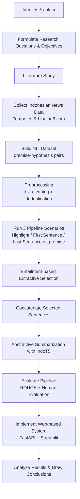
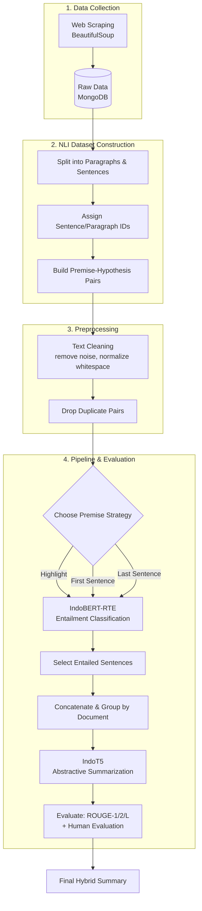
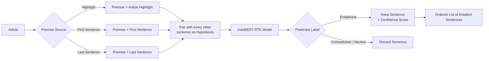
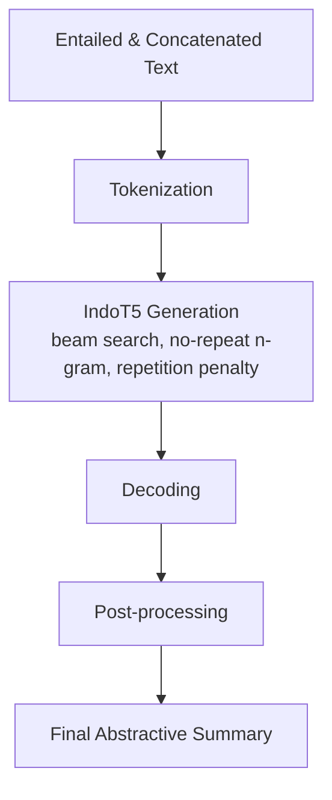
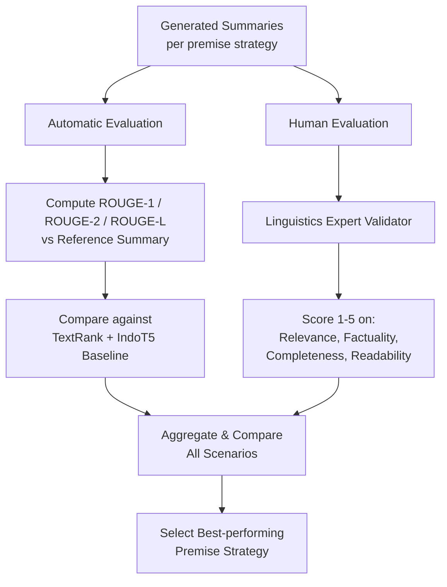
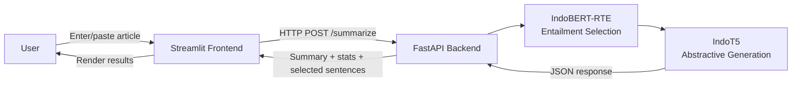
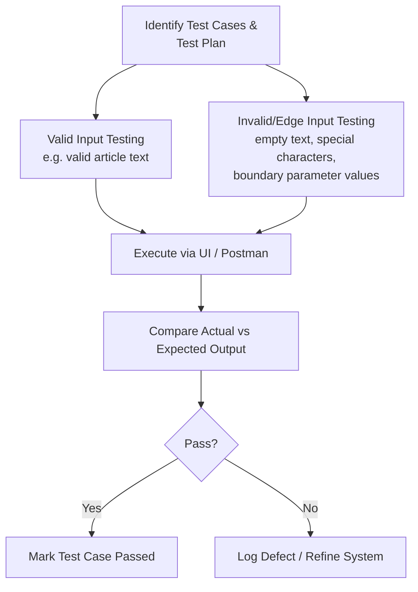
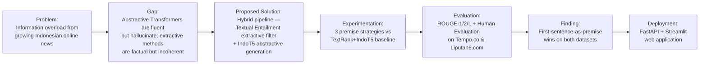

# System Workflow & Architecture

This document describes the end-to-end workflow of the hybrid summarization
system, from research design down to the deployed web application. Flowcharts
are provided as Mermaid diagrams (renderable on GitHub, GitLab, VS Code, and
most Markdown viewers). Standalone copies of each diagram also live in
[`diagrams/`](./diagrams).

---

## 1. Overall Research Flow

The research proceeds from problem identification through system
implementation and conclusion.

---

## 2. End-to-End Pipeline Architecture

The core pipeline transforms a raw article into a hybrid (extractive +
abstractive) summary.

---

## 3. Textual Entailment Sentence Selection (Extractive Stage)

Three premise strategies are evaluated independently, each producing its own
set of entailed sentences.

**Result highlights from the thesis:**

| Premise strategy | Avg. selection ratio (Tempo) | Avg. selection ratio (Liputan6) | Avg. confidence |
|---|---|---|---|
| Highlight | 17.18% | 25.96% | ~0.94 |
| First sentence | 18.57% | 20.20% | ~0.94 |
| Last sentence | 13.49% | 10.70% | ~0.92 |

---

## 4. Abstractive Summarization Stage (IndoT5)

Key generation hyperparameters used: max input length 512, output length
30–256 tokens, 2 beams, no-repeat n-gram size 4, repetition penalty 1.5,
length penalty 1.0, early stopping enabled.

---

## 5. Evaluation Workflow

Two complementary evaluation tracks run in parallel: automatic (ROUGE) and
human (expert linguistic rubric).

---

## 6. Web System Architecture (FastAPI + Streamlit)

The FastAPI backend exposes a RESTful endpoint that receives the raw article
text (plus optional parameters such as premise strategy, compression ratio,
min/max summary length) and returns:

- the abstractive summary,
- the list of selected (entailed) sentences with confidence scores,
- summary statistics (total sentences, selected sentence count, selection
  ratio, output word count).

The Streamlit frontend provides an interactive UI (text area, buttons,
parameter widgets) and calls the backend API in real time, displaying the
final summary alongside transparency details of *why* those sentences were
kept (the entailment step).

---

## 7. System Testing Workflow (Black-box Testing)

Testing covers: input validation (empty text, whitespace-only, special
characters), parameter validation (e.g. `min_length >= max_length`,
compression ratio boundaries), UI behavior (reset form, error messages when
the backend is unavailable, expander interactions), and correctness of
displayed outputs (summary text, sentence counts, confidence categories).

---

## 8. Summary of the Full Journey (Problem → Solution)

